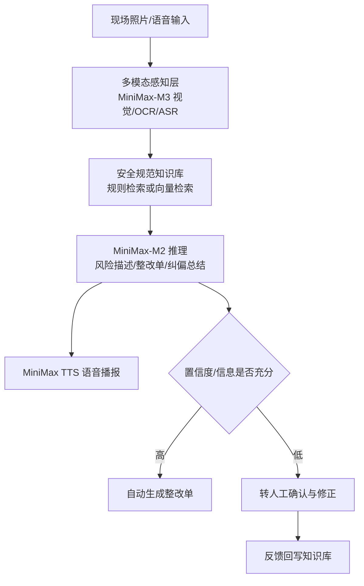

# 项目技术说明文档（模板）

> 提交时导出为 PDF，建议 8–12 页，文件控制在 30MB 以内。
> 队名：__________    队长：__________    提交日期：2026-08-31

## 1. 项目名称
工地隐患巡检与整改助手（可选英文名：SiteGuard AI）

## 2. 项目概述
本项目面向建筑工地安全巡检场景，打造一个“拍照即巡检、AI自动生成整改单、人工确认纠偏”的智能体。系统整合 MiniMax-M3 多模态视觉与 MiniMax 文本/语音能力，实现从隐患识别、规范匹配、整改建议生成到语音播报的全流程人机协同闭环。

## 3. 用户与痛点
- 用户：项目安全员、监理、一线工友、项目经理。
- 痛点一：人工巡检靠经验，隐患漏检率高。
- 痛点二：整改单编写耗时，格式和措辞不统一。
- 痛点三：AI识别结果无法完全信任，缺少人工复核和纠偏机制。
- 痛点四：工友阅读文字不便，语音播报更易理解。

## 4. 核心功能
1. 照片巡检：上传现场照片，识别安全帽、反光衣、动火作业等隐患。
2. 规范匹配：根据隐患类型自动匹配安全规范与整改措施。
3. 整改单生成：MiniMax 生成结构化风险描述、风险等级和整改建议。
4. 语音播报：MiniMax 语音合成，把整改要点播报给一线人员。
5. 人机确认：低置信度或信息不足项自动转人工；人工修正写入反馈日志。
6. 纠偏回写：人工反馈沉淀为后续同类场景的纠偏提示。

## 5. 系统架构

## 6. 技术实现
- 前端：Gradio 快速构建可交互 Demo。
- 感知：MiniMax-M3 多模态视觉（主路径）；可回退 PaddleDetection helmet 模型、PaddleOCR、Whisper/FunASR。
- 推理：MiniMax-M3 / MiniMax-M2，OpenAI 兼容 `/chat/completions`。
- 语音：MiniMax speech-2.8-turbo。
- 知识库：内置安全规范卡片；可升级为 BGE-M3 + Chroma 向量检索。
- 人机协同：低置信度自动转人工，人工反馈写入 `feedback_log.jsonl`。

## 7. 人机协同设计（评审重点，需展开）
- 协同规划：AI 负责“感知+初判”，人负责“复核+决策”，系统负责“记录+沉淀”。
- 交互迭代：人工确认或修正后，系统把反馈纳入下一轮提示上下文。
- AI纠偏管理：设置置信度阈值；未达到阈值不直接下发整改单，而是转人工。人工修正内容作为纠偏样本记录。

## 8. 技术创新点
1. 多模态融合：视觉、OCR、语音转写、文本生成、语音合成五类能力协同。
2. 人机协同闭环：不是单向“AI给结果”，而是可确认、可修正、可回写。
3. 低置信度转人工机制：兼顾效率与安全。
4. 轻量可落地：无代码化前端 + API化模型，便于快速部署到工地移动端。
5. 规则库可扩展：从固定规则平滑升级到向量检索。

## 9. 落地可行性与应用价值
- 可先以 Web 端 Demo 试运行，后续封装为小程序/App，与工地监控系统对接。
- 降低人工巡检漏检率，缩短整改单生成时间。
- 语音播报降低一线工友理解门槛，直接服务“为工友谋幸福”的主题。

## 10. 使用说明
1. 上传现场照片。
2. 点击“开始巡检”。
3. 查看识别结果与整改建议草稿。
4. 点击语音播报，听取整改要点。
5. 在“人机协同确认”页对低置信度项进行确认或修正。

## 11. 后续规划
- 接入更多隐患类型：临边防护、吊装、有限空间。
- 接入工地摄像头流，实现连续巡检。
- 用真实整改反馈训练更精准的纠偏策略。
- 生成周报/月报，辅助安全管理决策。
